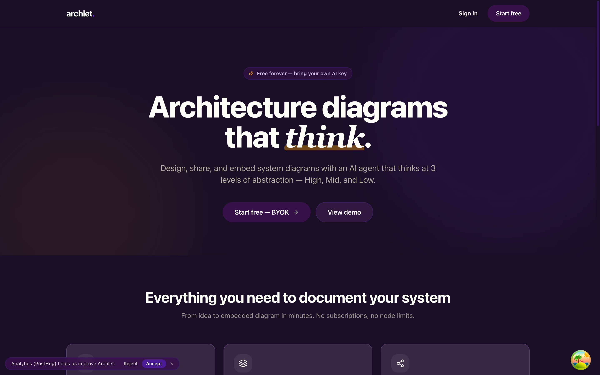
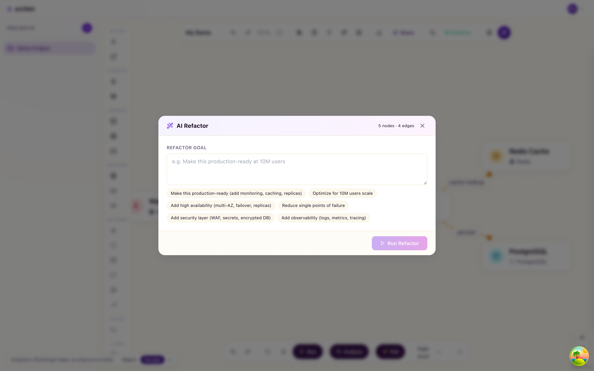
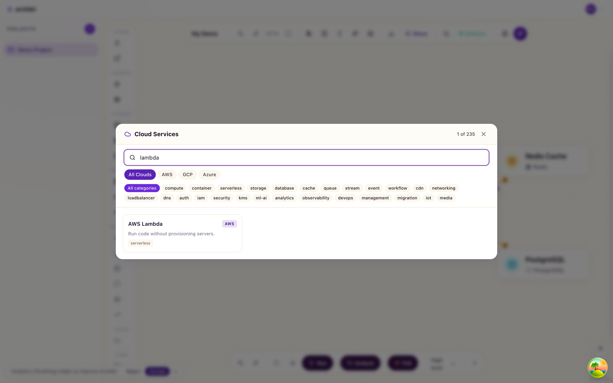
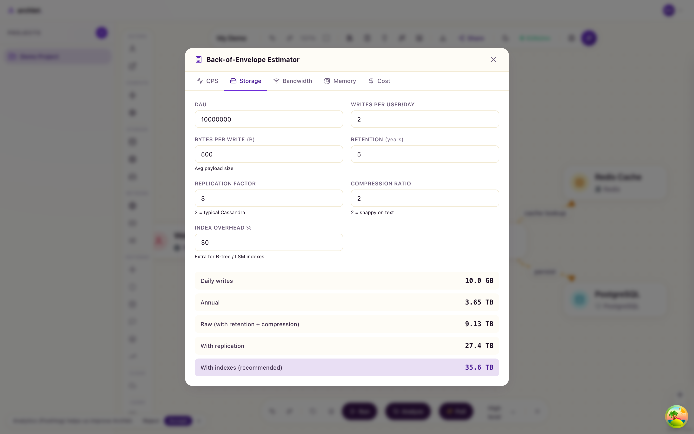
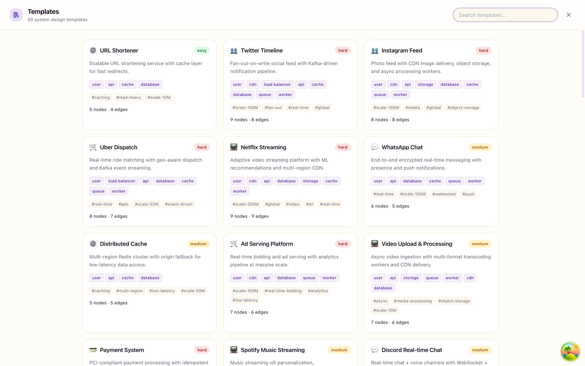

# archlet

> **System-design diagramming + interview-prep platform.** AI-assisted, BYOK, Cloudflare-native.

<p align="center">
  
</p>

<p align="center">
  <a href="LICENSE"></a>
  
  
  
</p>

---

## Why archlet

Most system-design tools are either **pretty pictures** (Excalidraw, draw.io) or **expensive enterprise** (Lucidchart, Miro). Archlet is built for **engineers preparing for system-design interviews** or **prototyping cloud architectures** — with first-class AI, capacity simulation, and a 235-service cloud catalog.

| Feature | What it does |
|---|---|
| 🎨 **Canvas** | Drag-drop nodes, smart edges, multi-level abstraction (high/mid/low) |
| 🌩 **Cloud Services Picker** | 235 AWS/GCP/Azure services across 26 categories, searchable |
| 🤖 **AI Generate** | Text-to-architecture via Anthropic/OpenAI/DeepSeek (BYOK) |
| 🪄 **AI Refactor Agent** | "Make this production-ready" → AI mutates your diagram via tool calls |
| 💡 **AI Hint System** | 3-level escalating hints for stuck moments (interview-style) |
| 🧠 **Mentor Chat** | Q&A about your design with streaming AI |
| 📚 **Learn Mode** | 28 system-design chapters (Alex Xu) with in-app markdown viewer |
| 📐 **50 Templates** | Real-world apps (Twitter, Netflix, Uber…) + architectural patterns + industry stacks |
| 🧮 **Back-of-Envelope Estimator** | 5-tab calculator: QPS / Storage / Bandwidth / Memory / Cost |
| ⚡ **Live Simulation** | Visual req/s flow, capacity health, failure modes |
| 💰 **Cost Estimate** | Per-node $/mo with AWS list prices |
| 📦 **IaC Export** | Terraform AWS + Kubernetes + Docker Compose + Ansible |
| 🔍 **Review Engine** | Rule-based + AI critique for bottlenecks, SPOFs, missing components |

---

## Screenshots

### Canvas + AI Refactor


### Cloud Services picker (235 services)


### Back-of-envelope estimator


### Templates gallery (50 templates)


### Learn — 28 system-design chapters


### Mentor chat (BYOK)


> ℹ️ All screenshots live in `.github/assets/`. See [`docs/screenshots-guide.md`](docs/screenshots-guide.md) for the full capture checklist.

---

## Tech stack

| Layer | Tech |
|---|---|
| Frontend | React 18, Vite, TypeScript, Tailwind v4, shadcn/ui, xyflow (React Flow) |
| AI clients | Anthropic, OpenAI, DeepSeek (BYOK, browser-direct streaming) |
| Backend | Hono on Cloudflare Workers |
| Database | Cloudflare D1 (SQLite) + Drizzle ORM |
| Auth | Better Auth (email + password, session cookies) |
| Markdown | react-markdown + remark-gfm + rehype-sanitize |
| Build | Turborepo + pnpm workspaces |

**Why Cloudflare?** Free-tier generous, edge-deployed by default, single-file Worker, no cold start.

---

## Quickstart

### Prerequisites

- Node.js 22+
- pnpm 9+
- Cloudflare account (for D1 + Workers; free tier OK)
- Optional: BYOK Anthropic / OpenAI / DeepSeek key

### Local dev

```bash
pnpm install

# Setup local D1 (creates SQLite file)
cd apps/api
cp .dev.vars.example .dev.vars   # then edit BETTER_AUTH_SECRET to 32+ chars
pnpm wrangler d1 migrations apply DB --local
cd ../..

# Start dev (web @ 5173, api @ 8787)
pnpm dev
```

Open http://localhost:5173 — sign up → start drawing.

### Deploy to Cloudflare

```bash
# 1. Create D1 database
pnpm -F @archlet/api wrangler d1 create archlet-db
# → copy the database_id into apps/api/wrangler.toml

# 2. Apply migrations to remote D1
pnpm -F @archlet/api wrangler d1 migrations apply DB

# 3. Set production secret (32+ chars)
pnpm -F @archlet/api wrangler secret put BETTER_AUTH_SECRET

# 4. Update apps/api/wrangler.toml vars:
#    BETTER_AUTH_URL=https://your-worker.workers.dev
#    WEB_ORIGIN=https://your-web.pages.dev

# 5. Deploy API (Workers)
pnpm -F @archlet/api wrangler deploy

# 6. Build + deploy web (Cloudflare Pages)
pnpm -F @archlet/web build
# Connect apps/web/dist via Pages dashboard or:
pnpm -F @archlet/web wrangler pages deploy dist
```

---

## BYOK setup

Archlet **never sees your AI provider keys**. After login:
1. Account → API Keys
2. Paste Anthropic / OpenAI / DeepSeek key
3. Stored in browser **localStorage** only
4. Direct browser→provider calls (Anthropic supports `anthropic-dangerous-direct-browser-access`)

Optional: route via the Mentor backend (`/api/mentor/chat`) for D1-persisted history.

---

## Architecture

```
┌─────────────────────────────────────────────────────────┐
│  Cloudflare Pages (apps/web)                            │
│  React SPA — canvas (xyflow) + AI modals + Estimator    │
└──────────────────┬──────────────────────────────────────┘
                   │ session cookie + BYOK header
                   │
┌──────────────────▼──────────────────────────────────────┐
│  Cloudflare Workers (apps/api) — Hono                   │
│  /api/projects /api/diagrams /api/share /api/mentor     │
└──────────────────┬──────────────────────────────────────┘
                   │
       ┌───────────┴────────────┐
       │                        │
┌──────▼───────┐      ┌────────▼────────┐
│  D1 SQLite   │      │  Anthropic /    │
│  users +     │      │  OpenAI / DS    │
│  diagrams +  │      │  (user's key,   │
│  mentor logs │      │   passthrough)  │
└──────────────┘      └─────────────────┘
```

---

## Repo layout

```
apps/
├── api/              Cloudflare Worker (Hono + Drizzle + Better Auth)
└── web/              Vite React SPA
packages/
└── shared/           Zod schemas, variants catalog, templates, cloud services
plans/                Implementation plans (multi-phase)
docs/                 Screenshots guide + dev docs
```

---

## Security

See [SECURITY.md](SECURITY.md). TL;DR:
- **Secrets**: `.env*`, `.dev.vars*` git-ignored. Only `.example` files committed.
- **BYOK**: Keys live in browser localStorage. Never logged server-side.
- **Auth**: Better Auth session cookies (HttpOnly + SameSite=Lax).
- **Public deploys must set production `BETTER_AUTH_SECRET` via `wrangler secret put`.**

---

## Roadmap

Active backlog under [`plans/`](plans/). Highlights:

- ✅ 50 hand-curated templates + 235 cloud services catalog
- ✅ AI Generate + Refactor Agent + Hint System (BYOK)
- ✅ Back-of-envelope estimator (5 dimensions)
- ✅ Learn mode with 28 Alex Xu chapters
- 🟡 Mock Interview Mode (timer + AI grading)
- 🟡 Spaced Repetition Review
- ⏳ Cloud Services Phase B: per-cloud discriminatedUnion configs
- ⏳ Mentor RAG with Cloudflare Vectorize
- ⏳ IaC export per cloud (Terraform GCP + Azure)

---

## License

[MIT](LICENSE) — fork, modify, ship commercially. Attribution appreciated but not required.

---

<p align="center">Built with ☕ + Claude. Star ⭐ if useful.</p>
